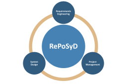

# RePoSyD

> Requirements Development, Project Management and System Design integrated in one tool for model-based Systems Engineering.

# RePoSyD - Utils

RePoSyD Blockly is part of RePoSyD and provides the helper classes and methods for RePoSyD.

## Installation

## RePoSyD Modules

- @reposyd/blockly
- @reposyd/core
- @reposyd/rg
- @reposyd/server

## Resources

## License

MIT

## Author(s)

Copyright (c) 2018-present Martin Hoppe

- [@ma67ho](https://github.com/ma67ho)
